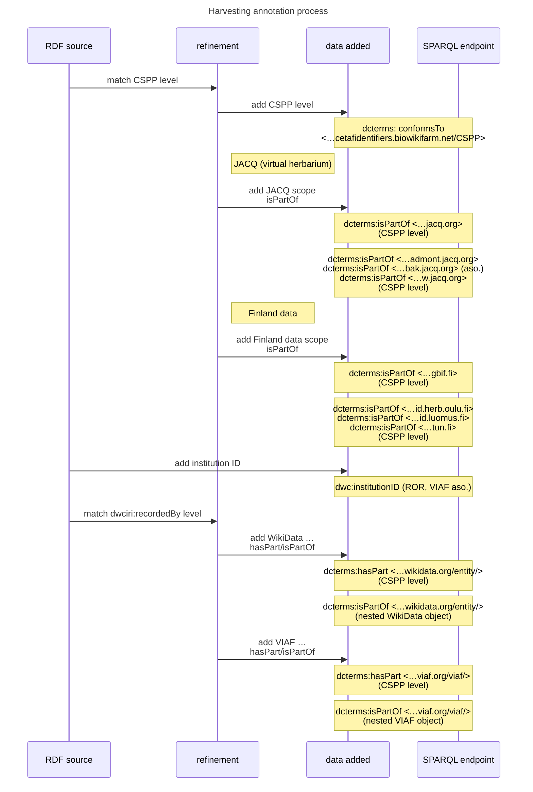

# Harvesting annotation process

Some properties are added for better managing data or querying the data faster. The following is a sketch (in development)

```mermaid
sequenceDiagram
    Title: Harvesting annotation process
    participant RDF source
    participant refinement
    participant data added
    participant SPARQL endpoint
    RDF source->>refinement: match CSPP level
    refinement->>data added: add CSPP level
    Note over data added,SPARQL endpoint: dcterms: conformsTo<br/> <…cetafidentifiers.biowikifarm.net/CSPP>
    Note right of refinement: JACQ (virtual herbarium)
    refinement->>data added: add JACQ scope<br/>isPartOf
    Note over data added,SPARQL endpoint: dcterms:isPartOf <…jacq.org><br/>(CSPP level)
    Note over data added,SPARQL endpoint: dcterms:isPartOf <…admont.jacq.org><br/>dcterms:isPartOf <…bak.jacq.org> (aso.)<br/>dcterms:isPartOf <…w.jacq.org><br/>(CSPP level)

    Note right of refinement: Finland data
    refinement->>data added: add Finland data scope<br/>isPartOf
    Note over data added,SPARQL endpoint: dcterms:isPartOf <…gbif.fi><br/>(CSPP level)
    Note over data added,SPARQL endpoint: dcterms:isPartOf <…id.herb.oulu.fi><br/>dcterms:isPartOf <…id.luomus.fi><br/>dcterms:isPartOf <…tun.fi><br/>(CSPP level)

    %% isPartOf  http://gbif.fi
    %% Data set of institution
    RDF source->>data added: add institution ID
    Note over data added,SPARQL endpoint: dwc:institutionID (ROR, VIAF aso.)
    RDF source->>refinement: match dwciri:recordedBy level

    %% WikiData recordedBy
    refinement->>data added: add WikiData …<br/>hasPart/isPartOf
    Note over data added,SPARQL endpoint: dcterms:hasPart <…wikidata.org/entity/><br/>(CSPP level)
    Note over data added,SPARQL endpoint: dcterms:isPartOf <…wikidata.org/entity/><br/>(nested WikiData object)
    %% VIAF recordedBy
    refinement->>data added: add VIAF …<br/>hasPart/isPartOf
    Note over data added,SPARQL endpoint: dcterms:hasPart <…viaf.org/viaf/><br/>(CSPP level)
    Note over data added,SPARQL endpoint: dcterms:isPartOf <…viaf.org/viaf/><br/>(nested VIAF object)
```
